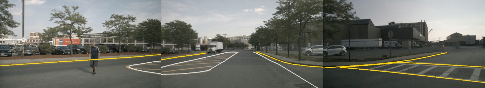
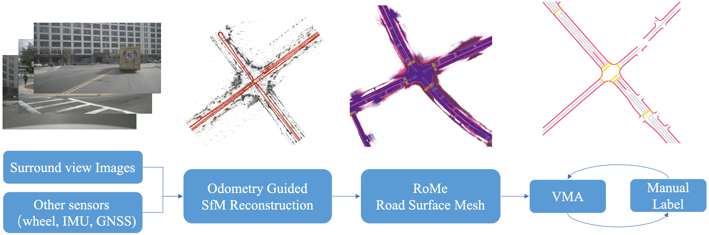

# CAMA
Official Implementation of A Vision-Centric Approach for Static Map Element Annotation  
[Arxiv](https://arxiv.org/abs/2309.11754) | [Youtube](https://www.youtube.com/watch?v=oBa4ngd2b9Y) | [Bilibili](https://www.bilibili.com/video/BV1ek4y1F7nJ)  

**CAMA**: **C**onsistent and **A**ccurate **M**ap **A**nnotation, nuScenes example:  

  

## Pipeline

  

