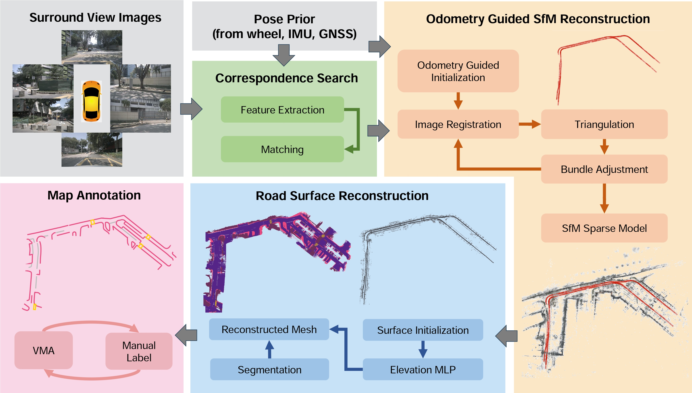

# CAMA
Official Implementation of A Vision-Centric Approach for Static Map Element Annotation  
CAMA： [Arxiv](https://arxiv.org/abs/2309.11754) | [Youtube](https://www.youtube.com/watch?v=oBa4ngd2b9Y) | [Bilibili](https://www.bilibili.com/video/BV1ek4y1F7nJ)  
CAMAv2： [Arxiv](https://arxiv.org/abs/2407.21331) | [Youtube](https://www.youtube.com/watch?v=npbbOEpuTno) | [Bilibili](https://www.bilibili.com/video/BV1afeFeAEsg)

**CAMA**: **C**onsistent and **A**ccurate **M**ap **A**nnotation, nuScenes example:  
<p align="left">
  
</p>

## Pipeline
<p align="left">
  
</p>

## Release Notes  
### 2.0.0 (2024-07-31)
* camav2_labels.zip [[Google Drive](https://drive.google.com/file/d/1B-C6XyfnxfmHaKcp6U2Hygy-TpTmtQce/view?usp=sharing)]
* CAMAv2 aggregates scenes with intersecting portions into one large scene called a **site**.
* It solves the shortcoming of dropping head and tail frames in camav1.
### 1.0.0 (2023-10-13)  
* cama_label.zip [[Google Drive](https://drive.google.com/file/d/1QUae0pMtXxfGCzjprN1_cKuXdjD854Qj/view?usp=sharing)]  
* Upload nuScenes 73 scenes from v1.0-test with CAMA labels.  
* Add reprojection demo for both CAMA and nuScenes origin labels.  
* **Note**: if using this older version, change ``self.map_width`` and ``self.map_height`` to 300 in [reproject.py](https://github.com/manymuch/CAMA/blob/main/cama/reproject.py#L26)

## Run: Reprojection Demo  

1. install required python packages  
    ```bash
    python3 -m pip install -r requirements.txt  
    ```
2. Download camav2_labels.zip [[Google Drive](https://drive.google.com/file/d/1B-C6XyfnxfmHaKcp6U2Hygy-TpTmtQce/view?usp=sharing)]

3. Modify config.yaml accordingly:  
    * **dataroot**: path to the origin nuScenes dataset  
    * **converted_dataroot**: output converted dataset dir  
    * **cama_label_file**: path to cama_label.zip you just download from 2  
    * **output_video_dir**: where the demo video writes
4. Run the pipeline  
    ```bash
    python3 main.py --config config.yaml
    ```

## Citation

If you benefit from this work, please cite the mentioned and our paper:

    @inproceedings{zhang2021deep,
      title={A Vision-Centric Approach for Static Map Element Annotation},
      author={Zhang, Jiaxin and Chen, Shiyuan and Yin, Haoran and Mei, Ruohong and Liu, Xuan and Yang, Cong and Zhang, Qian and Sui, Wei},
      booktitle={IEEE International Conference on Robotics and Automation (ICRA 2024)},
      pages={1-7}
    }

    @article{chen2024camav2,
      title={CAMAv2: A Vision-Centric Approach for Static Map Element Annotation},
      author={Chen, Shiyuan and Zhang, Jiaxin and Mei, Ruohong and Cai, Yingfeng and Yin, Haoran and Chen, Tao and Sui, Wei and Yang, Cong},
      journal={arXiv preprint arXiv:2407.21331},
      year={2024}
    }
  

